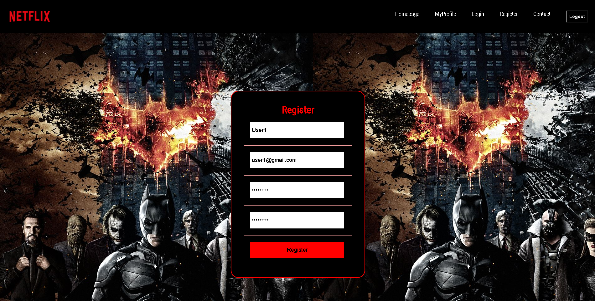
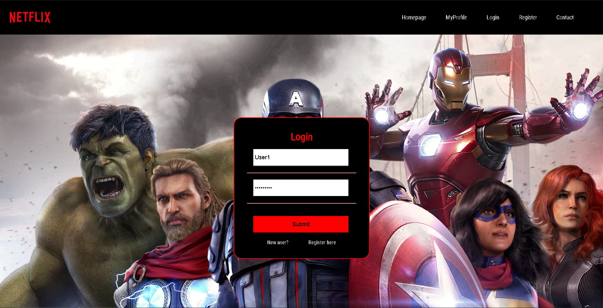
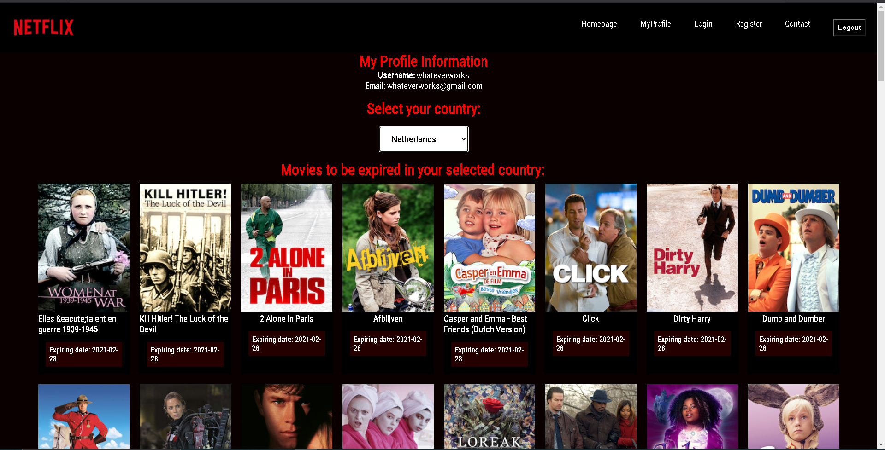
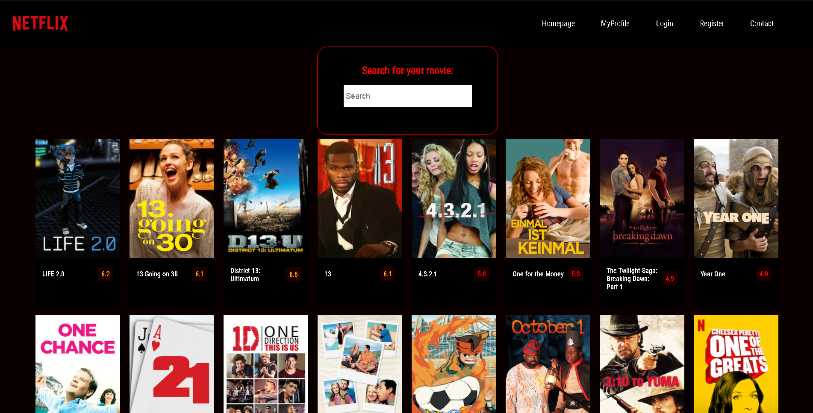

<h1>Installatiehandleiding</h1>

<h2>Inleiding</h2>

This application provides users to search for movies. Its functionality offers people to check
in which countries the searched movies/series are available, their imdbrating and a short synopsis
of the movie.

<h3>Requirements</h3>

- A clean computer/laptop
- For this application to run you will need an IDE like Webstorm. 
- To get the data from the API you will need it's key -> `('144c35bfc8msh6ad5c07734e15a7p15c7acjsn85ca2090551c')`
- Install Node.js and NPM. You can follow the instructions here -> (https://www.npmjs.com/get-npm)
- Install Axios -> `npm install axios`
- Install react-hook-form, react-router-dom -> `npm install react-hook-form`, `react-router-dom` 

<h3>Start up:</h3>

1. To start the application, go to the terminal at the bottom of your IDE. In the terminal type in: `npm start`
to launch the application.
2. Go to the Register page to make a new account, see picture below.

3. After successfully registering, go the Login page to login with your newly made account, see picture below.

4. After successfully login in, you will be directed to the profile page, see picture below.   

5. Here you will see your Profile information, and you can select a Country. You will then see 2 lists, 1 list will show
the movies that are to be expired and 1 list will show the movies that has been recently added.
6. At any time you can go to the homepage to look up any move available movie on Netflix, it will then tell you in which
countries that movie is available. See picture below.

<h3>CSS</h3>

The CSS that has been used for styling is flexbox. 

<h3>Accounts</h3>

There is no standard account available. You will have to register an account on your own to make use of the website.
You can follow the `Start up` instructions to do so.

